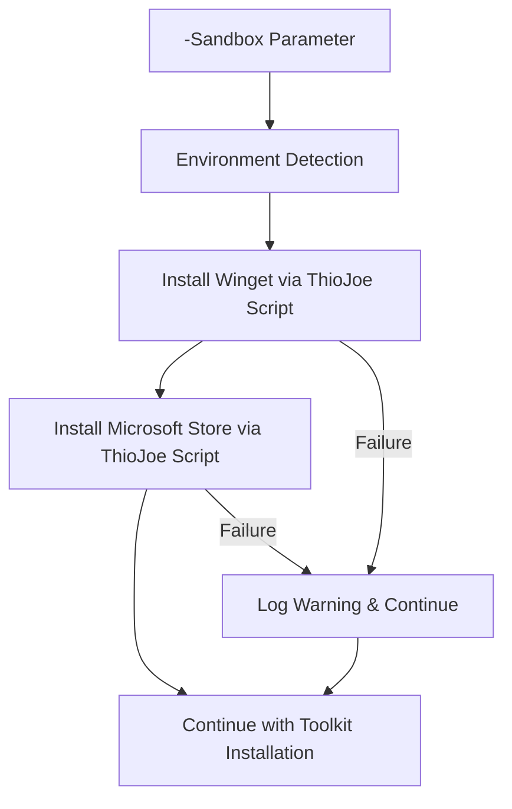

# 🧪 Windows Sandbox Integration Guide

*Last Updated: August 22, 2025*

This guide covers the Windows 11 Fresh Install Toolkit's integrated sandbox support. The sandbox integration provides a safe testing environment with automatic setup of prerequisites, featuring **automatic detection** (v2.0.1) and **timeout protection** (v2.0.2) for bulletproof sandbox installations!

---

## 🚀 Quick Start (v2.0.2)

> [!TIP]
> **🤖 Auto-Detection + ⏰ Timeout Magic:** v2.0.2 combines **automatic sandbox detection** with **installation timeout protection** - just use the regular one-line command for bulletproof sandbox testing!

### 🤖 Auto-Detection Method (v2.0.1) ⭐ **RECOMMENDED**
```powershell
# Just use the regular command - auto-detection handles everything!
irm https://raw.githubusercontent.com/Mantej-Singh/windows11-fresh-install-toolkit/main/Install-Windows11-Toolkit.ps1 | iex
```

**What happens automatically:**
1. **Detection**: Script detects Windows Sandbox environment
2. **Confirmation**: Asks "Would you like to enable Sandbox Mode? [Y/N]"
3. **Setup**: If you choose "Y", automatically installs prerequisites
4. **Installation**: Continues with full toolkit installation

### Manual Method (v2.0.0) - Still Available
```powershell
# Explicitly enable sandbox mode
.\Install-Windows11-Toolkit.ps1 -Sandbox
```

### With Profile Selection
```powershell
# Test with minimal profile
.\Install-Windows11-Toolkit.ps1 -Sandbox -Profile minimal

# Test with developer profile
.\Install-Windows11-Toolkit.ps1 -Sandbox -Profile developer
```

### Advanced Combinations
```powershell
# Sandbox with granular control
.\Install-Windows11-Toolkit.ps1 -Sandbox -SkipPowerManagement -OnlyApply "Privacy,Appearance"

# Remote execution with sandbox
irm https://raw.githubusercontent.com/Mantej-Singh/windows11-fresh-install-toolkit/main/Install-Windows11-Toolkit.ps1 | iex -ArgumentList '-Sandbox'
```

---

## 🎯 How Sandbox Integration Works

### v2.0.1 Auto-Detection Process
When you run the regular installation command, the toolkit automatically:

1. **Environment Detection**: Checks if running in Windows Sandbox
2. **User Confirmation**: Shows this prompt if sandbox detected:
   ```
   🧪 Windows Sandbox Environment Detected!
   
      This toolkit can automatically configure sandbox prerequisites:
      • Install Winget via ThioJoe's scripts  
      • Install Microsoft Store via ThioJoe's scripts
      • Continue with enhanced sandbox mode
      
      Would you like to enable Sandbox Mode? [Y/N]:
   ```
3. **User Choice**: 
   - **"Y"**: Enables sandbox mode and continues with setup
   - **"N"**: Continues with standard installation (no sandbox features)

### Sandbox Mode Features (When Enabled)
The sandbox integration automatically performs these steps:

1. **Environment Detection**: Checks if running in Windows Sandbox
2. **ThioJoe Script Integration**: 
   - Downloads and executes Install-Winget.ps1
   - Downloads and executes Install-Microsoft-Store.ps1
3. **Progress Tracking**: Shows progress and attribution for each step
4. **Error Resilience**: Continues execution even if prerequisites fail
5. **Attribution**: Proper crediting to ThioJoe throughout the process

---

## 🔧 Technical Implementation

### Prerequisites Installed
The sandbox mode automatically installs:

| Component | Source | Purpose |
|-----------|---------|---------|
| **Windows Package Manager (winget)** | [ThioJoe's Install-Winget.ps1](https://github.com/ThioJoe/Windows-Sandbox-Tools/blob/main/Installer%20Scripts/Install-Winget.ps1) | Application installation via winget |
| **Microsoft Store** | [ThioJoe's Install-Microsoft-Store.ps1](https://github.com/ThioJoe/Windows-Sandbox-Tools/blob/main/Installer%20Scripts/Install-Microsoft-Store.ps1) | Store app dependencies (optional) |

### Execution Flow


### Attribution & Credits
- **ThioJoe**: Original Windows Sandbox Tools creator
- **Repository**: [Windows-Sandbox-Tools](https://github.com/ThioJoe/Windows-Sandbox-Tools)
- **License**: MIT License
- **Video Tutorial**: [Windows Sandbox Setup Guide](https://www.youtube.com/watch?v=510O-FkGv6U)

---

## 🛡️ Safety & Limitations

### ✅ Advantages of Sandbox Testing
- **Complete Isolation**: Changes don't affect your main system
- **Risk-Free Testing**: Perfect for trying new configurations
- **Clean Environment**: Fresh Windows installation every time
- **No Persistence**: All changes discarded when sandbox closes
- **Quick Reset**: Simply restart sandbox for clean slate

### ⚠️ Sandbox Limitations & Solutions

> [!CAUTION]
> **Important Limitations to Consider:**

- **No Persistence**: All changes are lost when sandbox closes
- **Performance Impact**: May run slower than native installation
- **Memory Requirements**: Requires sufficient RAM for sandbox VM
- **Network Restrictions**: Some network features may be limited
- **Hardware Access**: Limited access to hardware features

> [!TIP]
> **v2.0.2 Timeout Protection:** Sandbox environments can have unreliable network connections that cause apps to hang. The new 3-minute timeout feature automatically handles these issues, ensuring your sandbox testing always completes successfully!

### 🔍 Troubleshooting

> [!NOTE]
> **Common Issues and Solutions:**

| Issue | Solution |
|-------|----------|
| **winget not found** | The script automatically installs it - wait for completion |
| **Microsoft Store missing** | Optional component - installation continues without it |
| **Slow downloads** | Sandbox environment may have slower network access |
| **Script execution errors** | The toolkit continues execution - check final summary |

---

## 🏗️ Manual Setup (Legacy Method)

> [!NOTE]
> **Legacy Support:** The manual method is still supported for users who prefer step-by-step control.

### Step-by-Step Process
```powershell
# Step 1: Enable Windows Sandbox (if not already enabled)
Enable-WindowsOptionalFeature -FeatureName "Containers-DisposableClientVM" -All -Online

# Step 2: In Windows Sandbox, install prerequisites
irm https://raw.githubusercontent.com/ThioJoe/Windows-Sandbox-Tools/main/Installer%20Scripts/Install-Winget.ps1 | iex
irm https://raw.githubusercontent.com/ThioJoe/Windows-Sandbox-Tools/main/Installer%20Scripts/Install-Microsoft-Store.ps1 | iex

# Step 3: Run the toolkit
irm https://raw.githubusercontent.com/Mantej-Singh/windows11-fresh-install-toolkit/main/Install-Windows11-Toolkit.ps1 | iex
```

---

## 📊 Comparison: Methods Across Versions

| Aspect | v2.0.1 Auto-Detection | v2.0.0 Sandbox Mode | Legacy Manual Method |
|--------|--------------------|-------------------|-------------------|
| **Commands Required** | 1 (standard) | 1 (with -Sandbox) | 4 |
| **User Interaction** | Confirmation prompt | None | Manual setup |
| **Error Handling** | Automatic | Automatic | Manual |
| **Progress Tracking** | Built-in | Built-in | None |
| **Attribution** | Automatic | Automatic | User responsibility |
| **Complexity** | Simplest | Simple | Complex |
| **User Experience** | Best (no parameters) | Good | Basic |
| **Flexibility** | High | High | Limited |

---

## 🎯 Use Cases

### 👨‍💻 **Developer Testing**
```powershell
# Test development profile safely
.\Install-Windows11-Toolkit.ps1 -Sandbox -Profile developer
```

### 🔧 **Configuration Validation**
```powershell
# Test specific tweak combinations
.\Install-Windows11-Toolkit.ps1 -Sandbox -OnlyApply "Privacy,Security"
```

### 📝 **Documentation & Demos**
```powershell
# Create clean demo environment
.\Install-Windows11-Toolkit.ps1 -Sandbox -Profile minimal
```

### 🧪 **Experimental Features**
```powershell
# Test with custom configuration
.\Install-Windows11-Toolkit.ps1 -Sandbox -Profile custom -CustomConfigUrl "https://example.com/test-config.json"
```

---

## 🚀 Best Practices

### ✅ Recommended Approach
1. **Test First**: Always test configurations in sandbox before production use
2. **Profile Selection**: Use appropriate profiles for different scenarios
3. **Granular Testing**: Test individual tweak categories separately
4. **Documentation**: Document working configurations for later use

### 🎯 Optimization Tips
1. **Memory Allocation**: Ensure sufficient RAM for smooth sandbox operation
2. **Network Speed**: Consider network speed for large downloads
3. **Profile Choice**: Use minimal profile for faster testing
4. **Batch Testing**: Test multiple configurations in sequence

---

## 🔗 Related Resources

### 📚 Documentation
- [Main README](../README.md) - Complete project overview
- [TWEAKS.md](TWEAKS.md) - Windows tweaks documentation
- [APPS.md](APPS.md) - Application installation guide
- [CHANGELOG.md](CHANGELOG.md) - Version history and changes

### 🛠️ Tools & Credits
- [ThioJoe's Windows Sandbox Tools](https://github.com/ThioJoe/Windows-Sandbox-Tools)
- [Windows Sandbox Documentation](https://docs.microsoft.com/en-us/windows/security/threat-protection/windows-sandbox/windows-sandbox-overview)
- [PowerShell Documentation](https://docs.microsoft.com/en-us/powershell/)

### 🎥 Video Tutorials
- [ThioJoe's Sandbox Setup Guide](https://www.youtube.com/watch?v=510O-FkGv6U)
- [Windows Sandbox Overview](https://www.youtube.com/@ThioJoe)

---

## 🙏 Attribution

> [!IMPORTANT]
> **Credits and Attribution:**

This sandbox integration is made possible by:

- **[ThioJoe](https://github.com/ThioJoe)** - Creator of Windows Sandbox Tools
- **Repository**: [Windows-Sandbox-Tools](https://github.com/ThioJoe/Windows-Sandbox-Tools)
- **License**: MIT License  
- **Special Thanks**: To ThioJoe for creating tools that make Windows Sandbox truly usable

The Windows 11 Fresh Install Toolkit's sandbox integration builds upon ThioJoe's excellent work while adding automation, error handling, and progress tracking for a seamless user experience.

---

## 📄 License

This documentation is part of the Windows 11 Fresh Install Toolkit, licensed under the MIT License. 

ThioJoe's Windows Sandbox Tools are separately licensed under the MIT License.

---

*For questions or issues related to sandbox integration, please visit our [GitHub Issues](https://github.com/Mantej-Singh/windows11-fresh-install-toolkit/issues) page.*

---

*Last Updated: August 22, 2025*